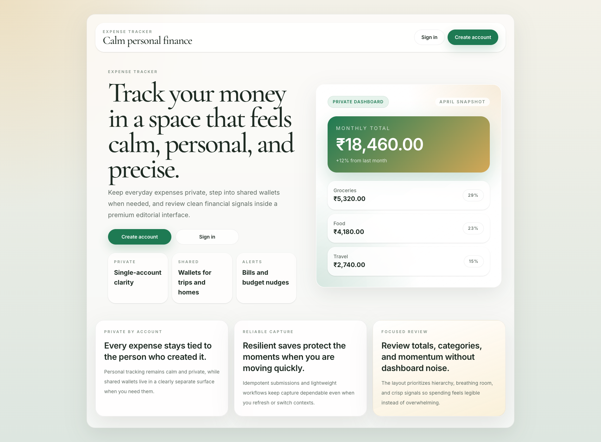
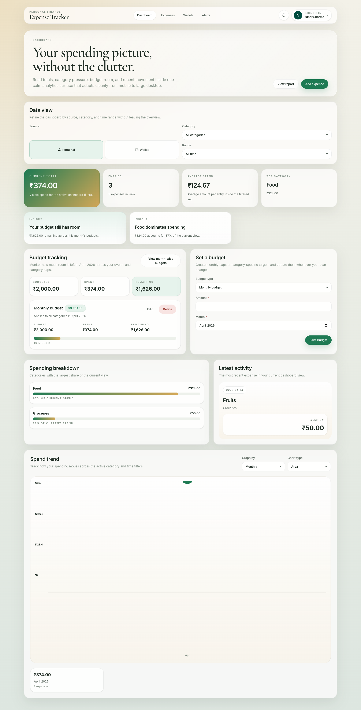
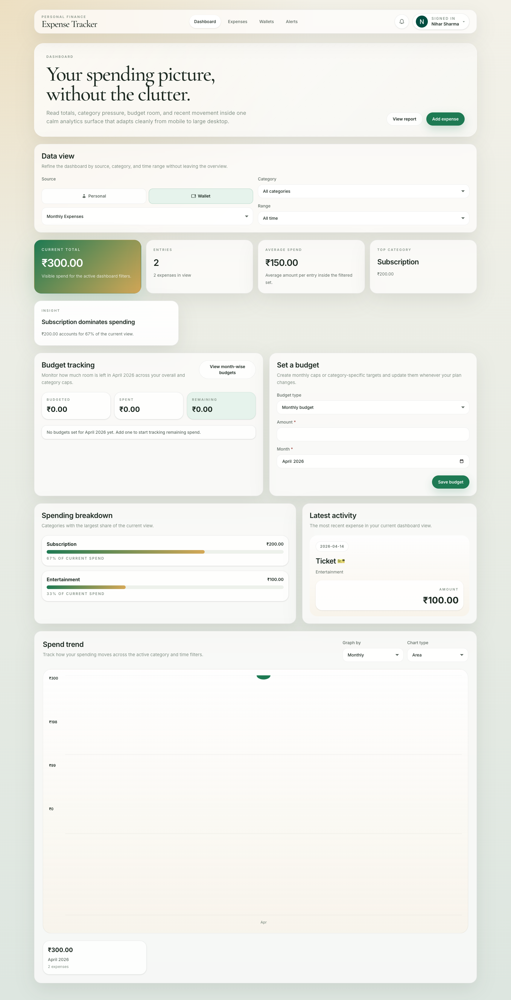
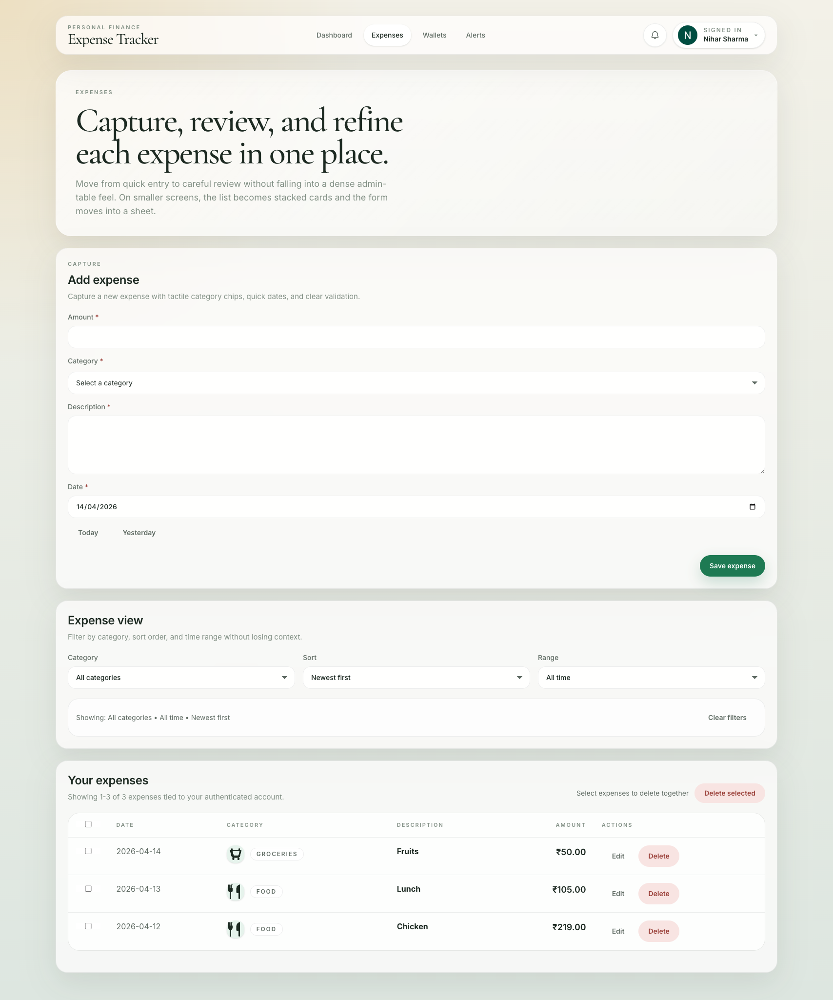
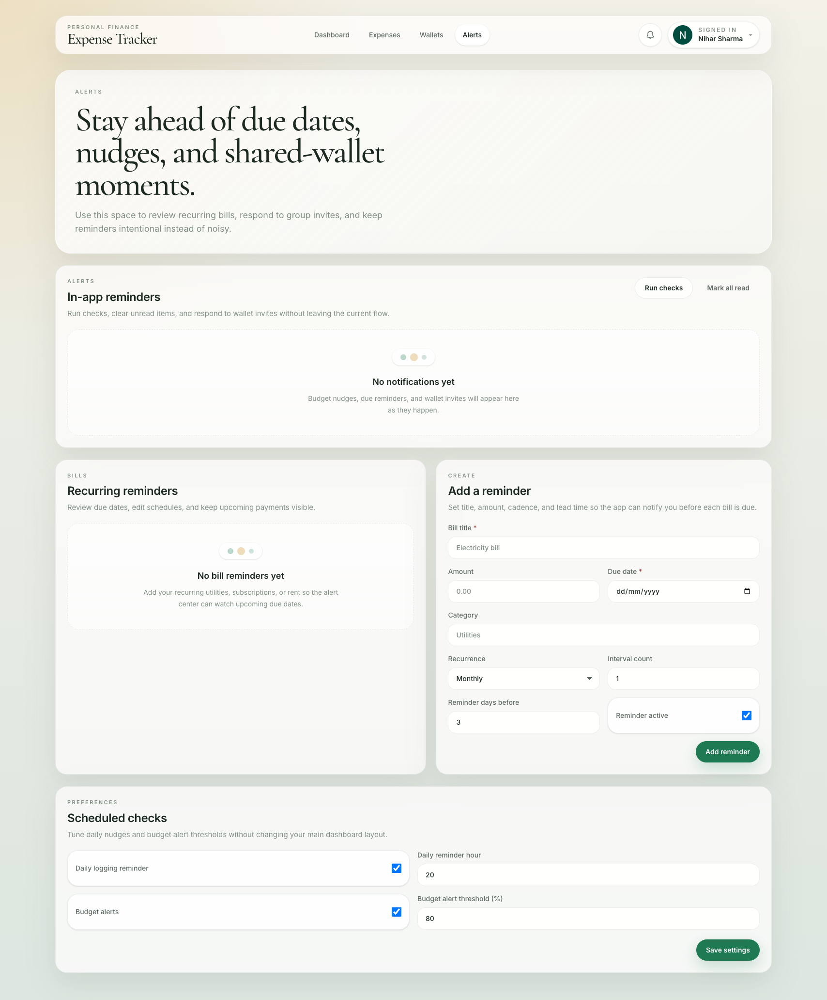
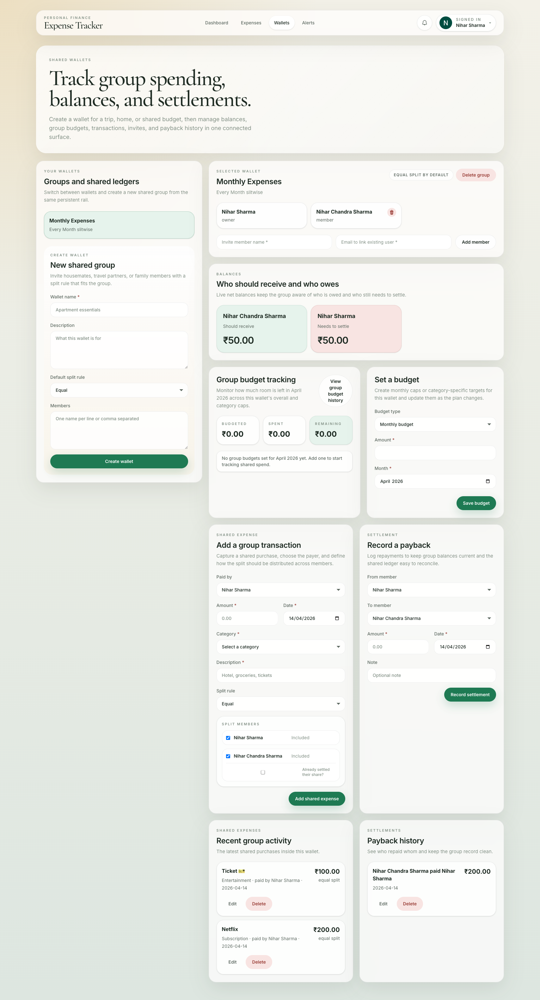

# Expense Tracker

A full-stack personal finance application for tracking daily spending, managing budgets, sharing group wallets, and staying on top of bills — built with TypeScript, React, Express, PostgreSQL, and Firebase Auth.

---

## Table of Contents

- [Features](#features)
- [Tech Stack](#tech-stack)
- [Architecture](#architecture)
- [Project Structure](#project-structure)
- [Authentication & Authorization](#authentication--authorization)
- [System Design](#system-design)
  - [Data Flow](#data-flow)
  - [API Design](#api-design)
  - [Storage Layer](#storage-layer)
  - [Idempotency](#idempotency)
  - [Deployment Model](#deployment-model)
- [Modules](#modules)
  - [Expenses](#expenses)
  - [Budgets](#budgets)
  - [Shared Wallets](#shared-wallets)
  - [Notifications & Alerts](#notifications--alerts)
  - [Bill Reminders](#bill-reminders)
  - [Dashboard](#dashboard)
- [Environment Variables](#environment-variables)
- [Getting Started](#getting-started)
- [Scripts](#scripts)
- [Screenshots](#screenshots)

---

## Features

- **Personal expenses** — Create, edit, delete, filter by category, and sort by date. Idempotent submission prevents duplicates on retry.
- **Budgets** — Set monthly or category-specific spending caps. Track remaining budget with overspend warnings.
- **Shared wallets** — Create group wallets for trips, homes, or shared budgets. Invite members, split expenses (equal, fixed, percentage), track balances, and record settlements.
- **Dashboard** — Unified overview with spending trends, category breakdowns, budget tracking, and auto-generated insights. Toggle between personal and wallet data sources.
- **Notifications & alerts** — Budget threshold warnings, overspend alerts, daily logging reminders, bill due alerts, and wallet invite notifications.
- **Bill reminders** — Schedule recurring bill reminders (once, weekly, monthly, yearly) with configurable advance notice.
- **Social authentication** — Sign in with Google, GitHub, or Facebook via Firebase Auth.
- **Account management** — Profile menu with sign-out and full account deletion (removes all data and the Firebase account).
- **Responsive design** — Desktop navigation bar with bottom tab navigation on mobile.
- **Dark-mode-ready surface system** — Tailwind CSS v4 with CSS custom properties for theming.

---

## Tech Stack

| Layer        | Technology                                                   |
| ------------ | ------------------------------------------------------------ |
| Frontend     | React 19, TypeScript, Vite, Tailwind CSS v4                 |
| Backend      | Node.js, TypeScript, Express (local dev)                    |
| Production   | Vercel Serverless Functions (API routes under `api/`)        |
| Database     | PostgreSQL via the `postgres` npm package (tagged templates) |
| Auth Client  | Firebase Auth (`signInWithPopup` for Google, GitHub, Facebook) |
| Auth Server  | Firebase Admin SDK (ID token verification)                   |
| Testing      | Vitest (backend unit tests with in-memory store)             |
| Monorepo     | npm workspaces (`backend/`, `frontend/`)                     |

---

## Architecture

```
┌───────────────────────────────────────────────────────────────┐
│                        Client (Browser)                       │
│                                                               │
│  React SPA ── Firebase Auth ── fetch("/api/...")              │
│  Vite Dev Server (port 5173) proxies /api → localhost:4101   │
└──────────────┬────────────────────────────────────────────────┘
               │  Authorization: Bearer <Firebase ID Token>
               ▼
┌───────────────────────────────────────────────────────────────┐
│                     API Layer                                 │
│                                                               │
│  Local:  Express server (port 4101)                          │
│  Prod:   Vercel Serverless Functions (api/*.js)              │
│                                                               │
│  ┌─────────────┐   ┌──────────────┐   ┌──────────────────┐  │
│  │ auth.ts     │   │ http.ts      │   │ lib/validation   │  │
│  │ Firebase    │──▶│ Handler fns  │◀──│ Zod schemas      │  │
│  │ Admin verify│   │ (pure logic) │   └──────────────────┘  │
│  └─────────────┘   └──────┬───────┘                          │
│                            │                                  │
│                    ┌───────▼────────┐                         │
│                    │  store/        │                         │
│                    │  ├ types.ts    │  ExpenseStore interface │
│                    │  ├ postgres.ts │  Production impl       │
│                    │  └ memory.ts   │  Test impl             │
│                    └───────┬────────┘                         │
└────────────────────────────┼──────────────────────────────────┘
                             │
                    ┌────────▼────────┐
                    │   PostgreSQL    │
                    │ (hosted/cloud)  │
                    └─────────────────┘
```

---

## Project Structure

```
expense-tracker/
├── api/                          # Vercel serverless entry points
│   ├── expenses.js               #   /api/expenses[/:id]
│   ├── budgets.js                #   /api/budgets[/:id]
│   ├── wallets.js                #   /api/wallets[/:id/...]
│   ├── notifications.js          #   /api/notifications[/:id/...]
│   ├── bill-reminders.js         #   /api/bill-reminders[/:id]
│   ├── wallet-invites.js         #   /api/wallet-invites[/:id/respond]
│   ├── reminder-preferences.js   #   /api/reminder-preferences
│   ├── account.js                #   /api/account
│   ├── health.js                 #   /api/health
│   └── _lib/                     #   Shared serverless utilities
│
├── backend/                      # Express backend (npm workspace)
│   ├── src/
│   │   ├── server.ts             #   Dev server entry (port 4101)
│   │   ├── app.ts                #   Express app factory with all routes
│   │   ├── auth.ts               #   Firebase Admin token verification
│   │   ├── http.ts               #   Pure handler functions
│   │   ├── lib/
│   │   │   └── validation.ts     #   Zod request schemas
│   │   └── store/
│   │       ├── types.ts          #   ExpenseStore interface & record types
│   │       ├── postgres.ts       #   PostgreSQL implementation
│   │       └── memory.ts         #   In-memory implementation (tests)
│   └── test/
│       └── expenses.test.ts      #   Vitest test suite
│
├── frontend/                     # React frontend (npm workspace)
│   ├── src/
│   │   ├── main.tsx              #   App entry point
│   │   ├── App.tsx               #   Root component (routing, state, API)
│   │   ├── auth.ts               #   Firebase Auth client setup
│   │   ├── types.ts              #   Shared TypeScript types
│   │   ├── styles.css            #   Tailwind v4 + custom theme
│   │   ├── pages/
│   │   │   ├── LandingPage.tsx   #   Pre-auth landing
│   │   │   ├── AuthPage.tsx      #   Sign-in with social providers
│   │   │   ├── DashboardPage.tsx #   Stats, budgets, trends, insights
│   │   │   ├── ExpensesPage.tsx  #   CRUD expenses with filters
│   │   │   ├── WalletsPage.tsx   #   Shared wallets management
│   │   │   └── AlertsPage.tsx    #   Notifications & bill reminders
│   │   ├── components/
│   │   │   ├── ui.tsx            #   Design system primitives
│   │   │   ├── BudgetTrackerSection.tsx
│   │   │   ├── CategoryIcon.tsx
│   │   │   ├── NotificationCenter.tsx
│   │   │   ├── ProfileMenu.tsx
│   │   │   ├── ConfirmModal.tsx
│   │   │   ├── AlertsSurface.tsx
│   │   │   └── ProviderLogo.tsx
│   │   └── layouts/
│   │       └── SignedInLayout.tsx #   App shell (nav, bottom tabs, profile)
│   └── vite.config.ts            #   Vite + Tailwind + dev proxy
│
├── images/                       # Application screenshots
├── vercel.json                   # Vercel deployment config & rewrites
├── package.json                  # Root workspace config
└── .env.example                  # Environment variable template
```

---

## Authentication & Authorization

### Sign-In Flow

```
User clicks "Sign in" ──▶ Firebase Auth popup (Google / GitHub / Facebook)
                                    │
                                    ▼
                          Firebase returns ID token
                                    │
                  ┌─────────────────┼─────────────────┐
                  ▼                                    ▼
          Stored in browser                   Sent as Bearer token
          (browserLocalPersistence)            on every API request
                                                       │
                                                       ▼
                                              Backend verifies token
                                              via Firebase Admin SDK
                                                       │
                                                       ▼
                                              Extracts user.id (UID),
                                              email, name, picture
                                                       │
                                                       ▼
                                              All queries scoped to UID
```

### Key Details

- **Client-side**: Firebase Auth with `signInWithPopup` and `browserLocalPersistence`. The `onAuthStateChanged` listener detects login state on page load.
- **Server-side**: Every API route passes through `withAuthenticatedUser()`, which decodes the `Authorization: Bearer <token>` header using `firebase-admin`. Unauthenticated requests receive a `401`.
- **Data isolation**: All database queries include the authenticated `userId` in their `WHERE` clauses. Users can only access their own expenses, budgets, and notifications.
- **Wallet access**: Wallet data is accessible to all linked members (not just the owner). The backend checks membership via `wallet_members` before returning wallet details.
- **Account deletion**: `DELETE /api/account` removes all user data from PostgreSQL and deletes the Firebase Auth account server-side.

---

## System Design

### Data Flow

1. **Frontend state**: `App.tsx` is the single source of truth. It holds all application state, fetches data from the API, and passes props down to page components.
2. **API calls**: The frontend uses `fetch()` with `Authorization: Bearer <token>` headers. In development, Vite proxies `/api` requests to the Express server on port 4101.
3. **Handler layer**: `http.ts` contains pure handler functions that accept parsed input and return `{ status, body }` objects. They are shared by both the Express app and Vercel serverless functions.
4. **Store interface**: `ExpenseStore` is a TypeScript interface in `store/types.ts`. `postgres.ts` implements it for production; `memory.ts` implements it for tests.

### API Design

All endpoints require authentication except `GET /api/health`.

| Method   | Endpoint                                          | Purpose                          |
| -------- | ------------------------------------------------- | -------------------------------- |
| GET      | `/api/expenses?category=...&sort=...`             | List expenses (filtered, sorted) |
| POST     | `/api/expenses`                                   | Create expense (idempotent)      |
| PUT      | `/api/expenses/:id`                               | Update expense                   |
| DELETE   | `/api/expenses/:id`                               | Delete expense                   |
| GET/POST | `/api/budgets`                                    | List / create budgets            |
| PUT      | `/api/budgets/:id`                                | Update budget                    |
| DELETE   | `/api/budgets/:id`                                | Delete budget                    |
| GET/POST | `/api/wallets`                                    | List / create wallets            |
| GET      | `/api/wallets/:id`                                | Get wallet detail (full)         |
| DELETE   | `/api/wallets/:id`                                | Delete wallet (owner only)       |
| POST     | `/api/wallets/:id/leave`                          | Leave wallet (member)            |
| POST     | `/api/wallets/:id/members`                        | Add member                       |
| DELETE   | `/api/wallets/:id/members/:memberId`              | Remove member                    |
| POST     | `/api/wallets/:id/expenses`                       | Create shared expense            |
| PUT      | `/api/wallets/:id/expenses/:expenseId`            | Update shared expense            |
| DELETE   | `/api/wallets/:id/expenses/:expenseId`            | Delete shared expense            |
| POST     | `/api/wallets/:id/budgets`                        | Create wallet budget             |
| PUT      | `/api/wallets/:id/budgets/:budgetId`              | Update wallet budget             |
| DELETE   | `/api/wallets/:id/budgets/:budgetId`              | Delete wallet budget             |
| POST     | `/api/wallets/:id/settlements`                    | Record settlement                |
| PUT      | `/api/wallets/:id/settlements/:settlementId`      | Update settlement                |
| DELETE   | `/api/wallets/:id/settlements/:settlementId`      | Delete settlement                |
| POST     | `/api/wallets/link-invites`                       | Link pending invites to user     |
| POST     | `/api/wallet-invites/:memberId/respond`           | Accept / decline invite          |
| GET      | `/api/notifications`                              | List notifications               |
| PATCH    | `/api/notifications/:id/read`                     | Mark notification read           |
| POST     | `/api/notifications/read-all`                     | Mark all read                    |
| DELETE   | `/api/notifications/:id`                          | Delete notification              |
| POST     | `/api/notifications/run-checks`                   | Trigger reminder checks          |
| GET/PUT  | `/api/reminder-preferences`                       | Get / update reminder settings   |
| GET/POST | `/api/bill-reminders`                             | List / create bill reminders     |
| PUT      | `/api/bill-reminders/:id`                         | Update bill reminder             |
| DELETE   | `/api/bill-reminders/:id`                         | Delete bill reminder             |
| DELETE   | `/api/account`                                    | Delete user account + all data   |
| GET      | `/api/health`                                     | Health check                     |

### Storage Layer

- **PostgreSQL** via the `postgres` npm package using tagged template literals for parameterized queries (SQL injection safe).
- **Schema auto-migration**: The Postgres store calls `ensureSchema()` before queries, which creates all tables and indexes if they do not exist.
- **Amounts**: Stored as `NUMERIC` in the database. The API returns normalized decimal strings to avoid floating-point drift.
- **In-memory store**: `memory.ts` implements the same `ExpenseStore` interface using `Map` collections. Used exclusively in tests for fast, isolated execution.

### Idempotency

`POST /api/expenses` requires an `Idempotency-Key` header. The backend stores a hash of the request alongside the created expense. If the same key is resubmitted, the original record is returned instead of creating a duplicate. The frontend generates a UUID key before each submission and stores the pending request in `localStorage` so it can retry safely after a page refresh or network failure.

### Deployment Model

```
Vercel
├── Frontend: Static build from frontend/dist (SPA with client-side routing)
├── API: Serverless functions from api/*.js
│         Each function imports the shared handler layer from backend/
│         and the Postgres store, then delegates to the same pure handlers
└── Rewrites: vercel.json maps nested API paths and SPA fallback
```

- **Local development**: `npm run dev` starts the Express server on port 4101 and Vite on port 5173. Vite proxies `/api` to Express.
- **Production**: Vercel builds the frontend with Vite and deploys the `api/` directory as serverless functions. `vercel.json` rewrites handle nested route parameters and SPA fallback to `index.html`.

---

## Modules

### Expenses

- Full CRUD with category filtering and date sorting (server-driven).
- Category selector with Font Awesome icons. Built-in categories use curated icons; custom categories have icons auto-assigned at creation time by matching the category name against a keyword map (60+ patterns, powered by `@fortawesome/free-solid-svg-icons`). Custom categories persist in `localStorage` per user.
- Inline form validation with per-field error messages.
- Pagination on the expenses list.
- Idempotent creation with `localStorage` retry on page refresh.

### Budgets

- Monthly or category-scoped budget caps.
- Budget tracker section showing spent, remaining, and overspend status.
- Budget history grouped by month with range filters (quarter, half-year, year, all).
- Edit and delete with inline status messages.

### Shared Wallets

- **Create wallets** with a name, description, default split rule, and initial members.
- **Member management**: Add/remove members, invite by email, accept/decline invitations.
- **Shared expenses**: Record group purchases with payer selection and three split modes (equal, fixed, percentage). Toggle individual split members. Mark members as "already settled" to auto-create settlement records.
- **Balances**: Real-time net balance per member (who owes, who receives, who is square).
- **Settlements**: Record, edit, and delete payback transactions.
- **Wallet budgets**: Same monthly/category budget system, scoped to the wallet's shared expenses.
- **Show more modals**: Filterable full-list views for expenses and settlements (month, category, amount range).
- **Access control**: All linked members see the same data. Only the owner can delete the wallet. Members can leave.

### Notifications & Alerts

- Budget threshold and overspend alerts.
- Daily logging reminders (configurable hour).
- Bill due reminders with advance notice.
- Wallet invite notifications with accept/decline actions.
- Invite response notifications (accepted/declined).
- Mark individual or all as read; delete notifications.
- Notification bell with unread badge in the header.

### Bill Reminders

- Create reminders for recurring bills (once, weekly, monthly, yearly).
- Configurable interval count and days-before reminder.
- Optional amount and category fields.
- Edit, delete, and toggle active/inactive.

### Dashboard

- **Data view toggle**: Switch between Personal and Wallet data sources with icons. Wallet mode shows a wallet selector dropdown.
- **Quick stats**: Expense count, average spend, top category, latest expense, and category breakdown.
- **Budget tracking**: Current month budget summaries and overview. Switches between personal and wallet budgets based on the active data view.
- **Spend trend chart**: Line/bar chart with daily, weekly, or monthly granularity.
- **Insights**: Auto-generated insights comparing month-over-month spending, budget pressure, and top categories.
- **Filters**: Category and time range selectors that refine all dashboard computations.

---

## Environment Variables

Copy `.env.example` to `.env` and fill in the values:

| Variable                             | Required | Description                                              |
| ------------------------------------ | -------- | -------------------------------------------------------- |
| `DATABASE_URL`                       | Yes      | PostgreSQL connection string                             |
| `VITE_FIREBASE_API_KEY`              | Yes      | Firebase web app API key                                 |
| `VITE_FIREBASE_AUTH_DOMAIN`          | Yes      | Firebase auth domain                                     |
| `VITE_FIREBASE_PROJECT_ID`           | Yes      | Firebase project ID                                      |
| `VITE_FIREBASE_APP_ID`              | Yes      | Firebase app ID                                          |
| `VITE_FIREBASE_STORAGE_BUCKET`       | No       | Firebase storage bucket                                  |
| `VITE_FIREBASE_MESSAGING_SENDER_ID`  | No       | Firebase messaging sender ID                             |
| `FIREBASE_PROJECT_ID`               | Yes      | Firebase Admin project ID (backend token verification)   |
| `FIREBASE_CLIENT_EMAIL`             | Yes      | Firebase Admin client email                              |
| `FIREBASE_PRIVATE_KEY`              | Yes      | Firebase Admin private key (use `\n` escapes in `.env`)  |
| `VITE_API_BASE_URL`                 | No       | Override API base URL (leave empty for same-origin/proxy) |

---

## Getting Started

### Prerequisites

- Node.js 18+
- A hosted PostgreSQL database
- A Firebase project with Authentication enabled (Google, GitHub, and/or Facebook providers)
- Firebase service account credentials for the backend

### Install & Run

```bash
# Install dependencies (root + workspaces)
npm install

# Start both backend and frontend in development
npm run dev
```

| Service  | URL                    |
| -------- | ---------------------- |
| Frontend | http://localhost:5173  |
| API      | http://localhost:4101  |

Vite proxies all `/api` requests to the Express backend automatically.

### Build & Test

```bash
# Compile both workspaces
npm run build

# Run backend test suite
npm test
```

---

## Scripts

| Script          | Description                                  |
| --------------- | -------------------------------------------- |
| `npm run dev`   | Start backend + frontend concurrently        |
| `npm run build` | Build backend (tsc) + frontend (tsc + vite)  |
| `npm test`      | Run Vitest tests in the backend workspace    |

---

## Screenshots













