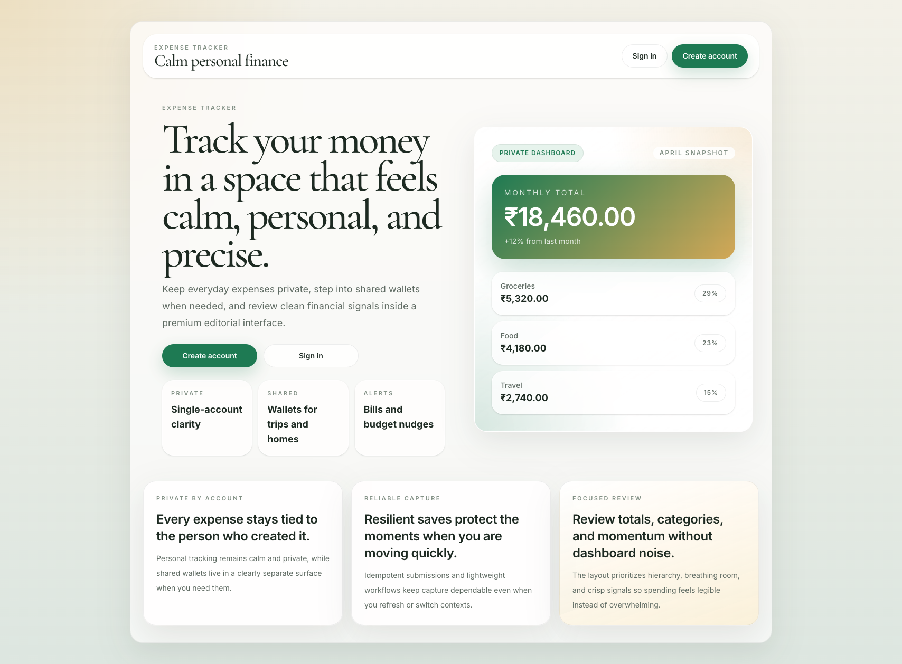
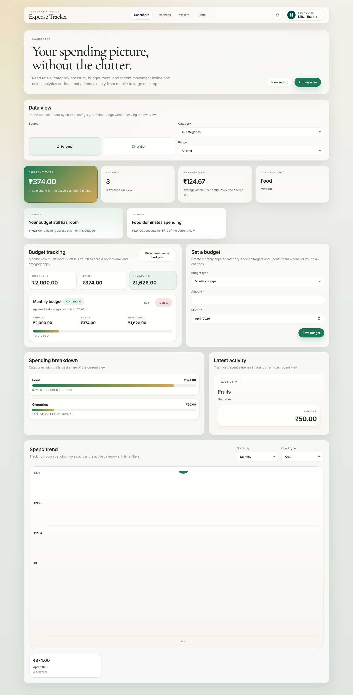
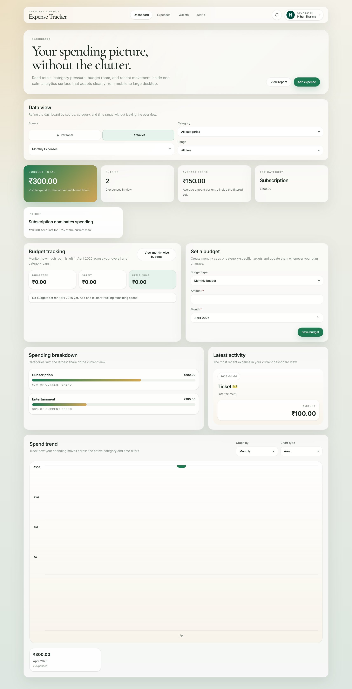
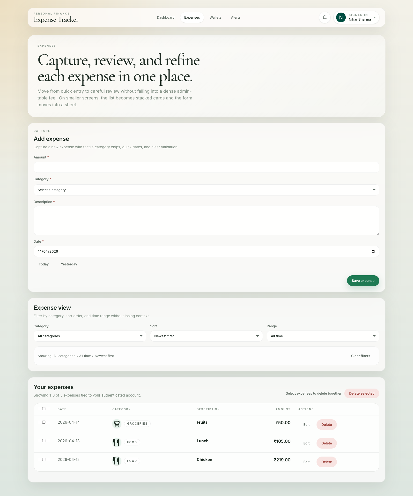
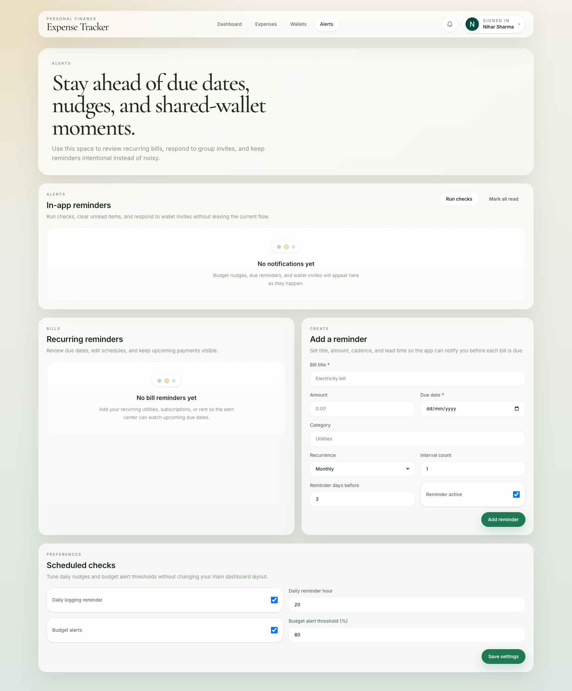
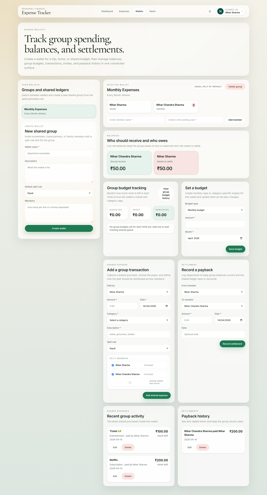

# Expense Tracker

A full-stack personal finance application for tracking daily spending, managing budgets, sharing group wallets, and staying on top of bills — built with TypeScript, React, Express, PostgreSQL, and Firebase Auth.

---

## Table of Contents

- [Features](#features)
- [Tech Stack](#tech-stack)
- [Architecture](#architecture)
- [Project Structure](#project-structure)
- [Authentication & Authorization](#authentication--authorization)
- [System Design](#system-design)
  - [Data Flow](#data-flow)
  - [API Design](#api-design)
  - [Storage Layer](#storage-layer)
  - [Idempotency](#idempotency)
  - [Deployment Model](#deployment-model)
- [Modules](#modules)
  - [Expenses](#expenses)
  - [Budgets](#budgets)
  - [Shared Wallets](#shared-wallets)
  - [Peer Loans & Lending Management](#peer-loans--lending-management)
  - [Notifications & Alerts](#notifications--alerts)
  - [Bill Reminders](#bill-reminders)
  - [Dashboard](#dashboard)
  - [AI Chatbot & MCP Server](#ai-chatbot--mcp-server)
- [Environment Variables](#environment-variables)
- [Getting Started](#getting-started)
- [Scripts](#scripts)
- [Screenshots](#screenshots)

---

## Features

- **Personal expenses** — Create, edit, delete, filter by category, and sort by date. Idempotent submission prevents duplicates on retry.
- **Budgets** — Set monthly or category-specific spending caps. Track remaining budget with overspend warnings.
- **Shared wallets** — Create group wallets for trips, homes, or shared budgets. Invite members, split expenses (equal, fixed, percentage), track balances, and record settlements. Features modal-based wallet creation, group picture uploads with automatic client-side WebP compression (up to 15MB cap), top active wallet banner with member initials chips, sub-tab workspace navigation (Overview, Transactions, Budget, Members), and zero-stale-data loading transitions.
- **Peer Loans & Wallet Lending** — Lend money directly to peers or shared wallet members with flexible interest schedules (monthly, yearly, one-time, fixed amount), customizable start dates, and maturity due dates. Track principal, accrued interest, partial repayments, and outstanding balances. Deferred on-demand loading optimizes initial app startup speed.
- **Borrower Mini Statement & Monthly Breakdown** — Consolidated, printable mini statement for any borrower. Features month-by-month financial summaries (borrowed amount, repaid amount, net delta, transaction frequency, overdue flags), lifetime lending aggregates, and a complete chronological ledger with high-contrast print/PDF styling.
- **Member Notifications & Overdue Loan Alerts** — Real-time in-app notifications sent to a member's email when a loan is issued. Automated background checks detect overdue loans and notify borrowers with exact overdue balance figures, paired with a persistent in-app Payment Overdue Alert Banner.
- **Dashboard** — Unified overview with spending trends, category breakdowns, budget tracking, and auto-generated insights. Toggle between personal and wallet data sources with seamless, dedicated loading screens and skeletons that eliminate stale data flicker. Automatically maps and visualizes converted currency amounts seamlessly.
- **Notifications & alerts** — Budget threshold warnings, overspend alerts, daily logging reminders, bill due alerts, wallet invite notifications, loan issuance notices, and overdue loan alerts. Timezone-aware scheduler ensures notifications deliver relative to the user's chosen local time.
- **Bill reminders** — Schedule recurring bill reminders (once, weekly, monthly, yearly) with configurable advance notice.
- **Social authentication** — Sign in with Google, GitHub, or Facebook via Firebase Auth.
- **Account management & profile editing** — Profile customization menu supporting custom usernames (with strict database uniqueness validation), local profile picture uploading (with auto-compression to avoid Firebase Auth attribute limits), OAuth provider avatar restoration, regional default currency and timezone selections, and full account/data deletion.
- **In-App AI Chatbot** — Interactive finance assistant scoped strictly to user expenses and wallets. Features semantic query searching across your entire transaction history. Prompts are monitored by strict guardrails, tool outputs are recursively sanitized to prevent prompt injections, and conversation histories are bounded to control costs. Incorporates a human-in-the-loop approval confirmation dialog for write operations (such as expense creation) and self-healing rate limit retry handlers.
- **Receipt Scanning (OCR)** — Upload single or multiple receipt photos to automatically extract details (merchant, amount, category, date, item breakdown description) in real-time, pre-filling a draft transaction form (personal or wallet) for user review. Validated by file magic-byte signatures and redacted for credit card numbers.
- **Model Context Protocol (MCP) Server** — Connect external tools (Cursor, Claude Desktop, etc.) to your expense tracker data using the standard Streamable HTTP SSE transport. Exposes semantic search (`search_expenses_semantic`) and structured retrieval tools, secured via user-managed SHA-256 hashed personal access tokens.
- **Responsive design** — Desktop navigation bar with bottom tab navigation on mobile.
- **Dark-mode-ready surface system** — Tailwind CSS v4 with CSS custom properties for theming.

---

## Tech Stack

| Layer        | Technology                                                   |
| ------------ | ------------------------------------------------------------ |
| Frontend     | React 19, TypeScript, Vite, Tailwind CSS v4                 |
| Backend      | Node.js, TypeScript, Express (local dev)                    |
| Production   | Vercel Serverless Functions (API routes under `api/`)        |
| Database     | PostgreSQL with `pgvector` extension via `postgres` npm package |
| Auth Client  | Firebase Auth (`signInWithPopup` for Google, GitHub, Facebook) |
| Auth Server  | Firebase Admin SDK (ID token verification)                   |
| Testing      | Vitest (backend unit tests with in-memory store)             |
| AI Inference | Llama 3.1 70B (NVIDIA NIM) & Gemini 2.5 Flash / Embeddings     |
| MCP Transport| Server-Sent Events (SSE) + HTTP POST JSON-RPC 2.0             |
| Monorepo     | npm workspaces (`backend/`, `frontend/`)                     |

---

## Architecture

```
┌───────────────────────────────────────────────────────────────┐
│                        Client (Browser)                       │
│                                                               │
│  React SPA ── Firebase Auth ── fetch("/api/...")              │
│  Vite Dev Server (port 5173) proxies /api → localhost:4101   │
└──────────────┬────────────────────────────────────────────────┘
               │  Authorization: Bearer <Firebase ID Token>
               ▼
┌───────────────────────────────────────────────────────────────┐
│                     API Layer                                 │
│                                                               │
│  Local:  Express server (port 4101)                          │
│  Prod:   Vercel Serverless Functions (api/*.js)              │
│                                                               │
│  ┌─────────────┐   ┌──────────────┐   ┌──────────────────┐  │
│  │ auth.ts     │   │ http.ts      │   │ lib/validation   │  │
│  │ Firebase    │──▶│ Handler fns  │◀──│ Zod schemas      │  │
│  │ Admin verify│   │ (pure logic) │   └──────────────────┘  │
│  └─────────────┘   └──────┬───────┘                          │
│                            │                                  │
│                    ┌───────▼────────┐                         │
│                    │  store/        │                         │
│                    │  ├ types.ts    │  ExpenseStore interface │
│                    │  ├ postgres.ts │  Production impl       │
│                    │  └ memory.ts   │  Test impl             │
│                    └───────┬────────┘                         │
└────────────────────────────┼──────────────────────────────────┘
                             │
                    ┌────────▼────────┐
                    │   PostgreSQL    │
                    │ (hosted/cloud)  │
                    └─────────────────┘
```

---

## Project Structure

```
expense-tracker/
├── api/                          # Vercel serverless entry points
│   ├── expenses.js               #   /api/expenses[/:id]
│   ├── budgets.js                #   /api/budgets[/:id]
│   ├── wallets.js                #   /api/wallets[/:id/...]
│   ├── notifications.js          #   /api/notifications[/:id/...]
│   ├── bill-reminders.js         #   /api/bill-reminders[/:id]
│   ├── wallet-invites.js         #   /api/wallet-invites[/:id/respond]
│   ├── reminder-preferences.js   #   /api/reminder-preferences
│   ├── account.js                #   /api/account
│   ├── health.js                 #   /api/health
│   └── _lib/                     #   Shared serverless utilities
│
├── backend/                      # Express backend (npm workspace)
│   ├── src/
│   │   ├── server.ts             #   Dev server entry (port 4101)
│   │   ├── app.ts                #   Express app factory with all routes
│   │   ├── auth.ts               #   Firebase Admin token verification
│   │   ├── http.ts               #   Pure handler functions
│   │   ├── lib/
│   │   │   └── validation.ts     #   Zod request schemas
│   │   └── store/
│   │       ├── types.ts          #   ExpenseStore interface & record types
│   │       ├── postgres.ts       #   PostgreSQL implementation
│   │       └── memory.ts         #   In-memory implementation (tests)
│   └── test/
│       └── expenses.test.ts      #   Vitest test suite
│
├── frontend/                     # React frontend (npm workspace)
│   ├── src/
│   │   ├── main.tsx              #   App entry point
│   │   ├── App.tsx               #   Root component (routing, state, API)
│   │   ├── auth.ts               #   Firebase Auth client setup
│   │   ├── types.ts              #   Shared TypeScript types
│   │   ├── styles.css            #   Tailwind v4 + custom theme
│   │   ├── pages/
│   │   │   ├── LandingPage.tsx   #   Pre-auth landing
│   │   │   ├── AuthPage.tsx      #   Sign-in with social providers
│   │   │   ├── DashboardPage.tsx #   Stats, budgets, trends, insights
│   │   │   ├── ExpensesPage.tsx  #   CRUD expenses with filters
│   │   │   ├── WalletsPage.tsx   #   Shared wallets management
│   │   │   └── AlertsPage.tsx    #   Notifications & bill reminders
│   │   ├── components/
│   │   │   ├── ui.tsx            #   Design system primitives
│   │   │   ├── BudgetTrackerSection.tsx
│   │   │   ├── CategoryIcon.tsx
│   │   │   ├── NotificationCenter.tsx
│   │   │   ├── ProfileMenu.tsx
│   │   │   ├── ConfirmModal.tsx
│   │   │   ├── AlertsSurface.tsx
│   │   │   └── ProviderLogo.tsx
│   │   └── layouts/
│   │       └── SignedInLayout.tsx #   App shell (nav, bottom tabs, profile)
│   └── vite.config.ts            #   Vite + Tailwind + dev proxy
│
├── images/                       # Application screenshots
├── vercel.json                   # Vercel deployment config & rewrites
├── package.json                  # Root workspace config
└── .env.example                  # Environment variable template
```

---

## Authentication & Authorization

### Sign-In Flow

```
User clicks "Sign in" ──▶ Firebase Auth popup (Google / GitHub / Facebook)
                                    │
                                    ▼
                          Firebase returns ID token
                                    │
                  ┌─────────────────┼─────────────────┐
                  ▼                                    ▼
          Stored in browser                   Sent as Bearer token
          (browserLocalPersistence)            on every API request
                                                       │
                                                       ▼
                                              Backend verifies token
                                              via Firebase Admin SDK
                                                       │
                                                       ▼
                                              Extracts user.id (UID),
                                              email, name, picture
                                                       │
                                                       ▼
                                              All queries scoped to UID
```

### Key Details

- **Client-side**: Firebase Auth with `signInWithPopup` and `browserLocalPersistence`. The `onAuthStateChanged` listener detects login state on page load.
- **Server-side**: Every API route passes through `withAuthenticatedUser()`, which decodes the `Authorization: Bearer <token>` header using `firebase-admin`. Unauthenticated requests receive a `401`.
- **Data isolation**: All database queries include the authenticated `userId` in their `WHERE` clauses. Users can only access their own expenses, budgets, and notifications.
- **Wallet access**: Wallet data is accessible to all linked members (not just the owner). The backend checks membership via `wallet_members` before returning wallet details.
- **Account deletion**: `DELETE /api/account` removes all user data from PostgreSQL and deletes the Firebase Auth account server-side.

---

## System Design

### Data Flow

1. **Frontend state**: `App.tsx` is the single source of truth. It holds all application state, fetches data from the API, and passes props down to page components.
2. **API calls**: The frontend uses `fetch()` with `Authorization: Bearer <token>` headers. In development, Vite proxies `/api` requests to the Express server on port 4101.
3. **Handler layer**: `http.ts` contains pure handler functions that accept parsed input and return `{ status, body }` objects. They are shared by both the Express app and Vercel serverless functions.
4. **Store interface**: `ExpenseStore` is a TypeScript interface in `store/types.ts`. `postgres.ts` implements it for production; `memory.ts` implements it for tests.

### API Design

All endpoints require authentication except `GET /api/health`.

| Method   | Endpoint                                          | Purpose                          |
| -------- | ------------------------------------------------- | -------------------------------- |
| GET      | `/api/expenses?category=...&sort=...`             | List expenses (filtered, sorted) |
| POST     | `/api/expenses`                                   | Create expense (idempotent)      |
| PUT      | `/api/expenses/:id`                               | Update expense                   |
| DELETE   | `/api/expenses/:id`                               | Delete expense                   |
| GET/POST | `/api/budgets`                                    | List / create budgets            |
| PUT      | `/api/budgets/:id`                                | Update budget                    |
| DELETE   | `/api/budgets/:id`                                | Delete budget                    |
| GET/POST | `/api/wallets`                                    | List / create wallets            |
| GET      | `/api/wallets/:id`                                | Get wallet detail (full)         |
| DELETE   | `/api/wallets/:id`                                | Delete wallet (owner only)       |
| POST     | `/api/wallets/:id/leave`                          | Leave wallet (member)            |
| POST     | `/api/wallets/:id/members`                        | Add member                       |
| DELETE   | `/api/wallets/:id/members/:memberId`              | Remove member                    |
| POST     | `/api/wallets/:id/expenses`                       | Create shared expense            |
| PUT      | `/api/wallets/:id/expenses/:expenseId`            | Update shared expense            |
| DELETE   | `/api/wallets/:id/expenses/:expenseId`            | Delete shared expense            |
| POST     | `/api/wallets/:id/budgets`                        | Create wallet budget             |
| PUT      | `/api/wallets/:id/budgets/:budgetId`              | Update wallet budget             |
| DELETE   | `/api/wallets/:id/budgets/:budgetId`              | Delete wallet budget             |
| POST     | `/api/wallets/:id/settlements`                    | Record settlement                |
| PUT      | `/api/wallets/:id/settlements/:settlementId`      | Update settlement                |
| DELETE   | `/api/wallets/:id/settlements/:settlementId`      | Delete settlement                |
| GET/POST | `/api/wallets/:id/loans`                          | List / create wallet loans       |
| PUT/DELETE | `/api/wallets/:id/loans/:loanId`                | Update / delete wallet loan      |
| POST/DELETE | `/api/wallets/:id/loans/:loanId/repayments`    | Record / delete loan repayment   |
| GET/POST | `/api/loans`                                      | List / create peer loans         |
| PUT/DELETE | `/api/loans/:loanId`                            | Update / delete peer loan        |
| POST/DELETE | `/api/loans/:loanId/repayments`                | Record / delete peer repayment   |
| POST     | `/api/wallets/link-invites`                       | Link pending invites to user     |
| POST     | `/api/wallet-invites/:memberId/respond`           | Accept / decline invite          |
| GET      | `/api/notifications`                              | List notifications               |
| PATCH    | `/api/notifications/:id/read`                     | Mark notification read           |
| POST     | `/api/notifications/read-all`                     | Mark all read                    |
| DELETE   | `/api/notifications/:id`                          | Delete notification              |
| POST     | `/api/notifications/run-checks`                   | Trigger reminder checks          |
| GET/PUT  | `/api/reminder-preferences`                       | Get / update reminder settings   |
| GET/POST | `/api/bill-reminders`                             | List / create bill reminders     |
| PUT      | `/api/bill-reminders/:id`                         | Update bill reminder             |
| DELETE   | `/api/bill-reminders/:id`                         | Delete bill reminder             |
| POST     | `/api/assistant/query`                            | In-app AI chatbot query (confirms write actions) |
| GET      | `/api/tokens`                                     | List user's active access tokens |
| POST     | `/api/tokens`                                     | Generate a new access token (one-time reveal)  |
| DELETE   | `/api/tokens/:tokenId`                            | Revoke or permanently delete (purge) token    |
| GET/POST | `/api/mcp`                                        | Standard streamable HTTP SSE MCP transport    |
| DELETE   | `/api/account`                                    | Delete user account + all data   |
| GET      | `/api/health`                                     | Health check                     |

### Storage Layer

- **PostgreSQL** via the `postgres` npm package using tagged template literals for parameterized queries (SQL injection safe).
- **Schema auto-migration**: The Postgres store calls `ensureSchema()` before queries, which creates all tables and indexes if they do not exist.
- **Amounts**: Stored as `NUMERIC` in the database. The API returns normalized decimal strings to avoid floating-point drift.
- **In-memory store**: `memory.ts` implements the same `ExpenseStore` interface using `Map` collections. Used exclusively in tests for fast, isolated execution.

### Idempotency

`POST /api/expenses` requires an `Idempotency-Key` header. The backend stores a hash of the request alongside the created expense. If the same key is resubmitted, the original record is returned instead of creating a duplicate. The frontend generates a UUID key before each submission and stores the pending request in `localStorage` so it can retry safely after a page refresh or network failure.

### Deployment Model

```
Vercel
├── Frontend: Static build from frontend/dist (SPA with client-side routing)
├── API: Serverless functions from api/*.js
│         Each function imports the shared handler layer from backend/
│         and the Postgres store, then delegates to the same pure handlers
└── Rewrites: vercel.json maps nested API paths and SPA fallback
```

- **Local development**: `npm run dev` starts the Express server on port 4101 and Vite on port 5173. Vite proxies `/api` to Express.
- **Production**: Vercel builds the frontend with Vite and deploys the `api/` directory as serverless functions. `vercel.json` rewrites handle nested route parameters and SPA fallback to `index.html`.

---

## Modules

### Expenses

- Full CRUD with category filtering and date sorting (server-driven).
- Category selector with Font Awesome icons. Built-in categories use curated icons; custom categories have icons auto-assigned at creation time by matching the category name against a keyword map (60+ patterns, powered by `@fortawesome/free-solid-svg-icons`). Custom categories persist in `localStorage` per user.
- Inline form validation with per-field error messages.
- Pagination on the expenses list.
- Idempotent creation with `localStorage` retry on page refresh.

### Budgets

- Monthly or category-scoped budget caps.
- Budget tracker section showing spent, remaining, and overspend status.
- Budget history grouped by month with range filters (quarter, half-year, year, all).
- Edit and delete with inline status messages.

### AI Chatbot & MCP Server

- **Strict Topic Scope**: System prompt enforces domain constraints (expenses, budgeting, wallets). General knowledge, creative writing, or injection attempts are deflected into positive finance suggestions.
- **No Private IDs Exposure**: Database UUID keys (`expenseid`, `userid`, `walletid`) are stripped from chatbot text responses to keep messages clean and focused on user-facing descriptions.
- **Write Actions Confirmation**: Triggering a write tool (e.g. `create_expense`) stops execution and renders a custom confirmation UI card inline in the chat bubble. The expense is committed only if the user explicitly approves.
- **NIM Worker Rate-Limits Recovery**: Backed by a 3-attempt backoff handler catching HTTP 503 limits from NVIDIA's model hosting.
- **External Integration (MCP)**: Standards-compliant Server-Sent Events (SSE) server allows external IDEs/clients (Cursor, Claude Desktop) to invoke read-only tracker tools (`list_expenses`, `get_expense_summary`, `list_wallets`, `get_wallet_balance`, `search_expenses_semantic`) with secure user scopes.
- **Personal Access Tokens Control**: Generated from the Settings profile card. Utilizes cryptographic SHA-256 hashing. Active tokens support soft **Revocation**; soft-revoked tokens display a **Delete** button to permanently clean up the audit trail via a React-based confirmation modal.
- **Semantic Search (`search_expenses_semantic`)**: Performs vector-based similarity queries (pgvector) on PostgreSQL to locate conceptual transactions matching semantic intent (e.g. searching for "sweet snacks" returns cake or cookies).
- **Security & Abuse Protections**:
  - **Tool Result Sanitization**: Recursively sanitizes and truncates tool-result objects to 500 characters per string field before injecting into the LLM context to block indirect injection vectors.
  - **Context Window Bounds**: Limits conversation history to the last 15 messages and truncates message content to 1,000 characters to control token costs and prevent cost exhaustion.
  - **Vector Query Float Guard**: Sanitizes and enforces strict float validation on vector arrays before pgvector query interpolation.
  - **Mime Type Magic-Byte Check**: Verifies uploaded receipt file signatures (JPEG, PNG, WebP) to reject malicious files masquerading as images.
  - **Multi-Layered Rate Limiting**: Enforces separate per-user bucket caps for assistant chat queries (10 RPM), receipt scans (5 RPM), and MCP connections (60 RPM).

### Shared Wallets

- **Modal-driven wallet creation**: Create wallets with a name, description, default split rule, default currency, group picture, and initial members via a focused modal dialog rather than taking vertical sidebar space.
- **Group pictures & client-side compression**: Upload group pictures with an enforced 15MB file cap; automatically compresses raw image files to optimized WebP at 512×512 using Canvas (achieving image-dependent file size reduction) with live size savings indicators.
- **Top active wallet banner**: Prominent banner showcasing the currently active wallet, description, currency, and members presented as colorful initials chips with owner crown indicator (`👑`) and hover tooltips for full details.
- **Workspace sub-tabs**: Fast switching between Overview, Transactions & Forms, Budget, Members & Roles, and All sections, accompanied by quick action buttons ("＋ Add Transaction" and "Record Payback").
- **Dedicated loading screen & stale data prevention**: Instant state reset and full-screen emerald spinner with animated placeholder skeleton cards during wallet switching, guaranteeing that previous wallet members, balances, and expenses never leak while loading new data.
- **Member management**: Add/remove members, invite by email, accept/decline invitations.
- **Shared expenses & receipt scanning**: Record group purchases with payer selection and three split modes (equal, fixed, percentage). Includes collapsible "Auto-fill from receipt (optional)" panel with direct camera photo capture and file upload OCR.
- **Balances**: Real-time net balance per member (who owes, who receives, who is square).
- **Settlements**: Record, edit, and delete payback transactions.
- **Wallet budgets**: Same monthly/category budget system, scoped to the wallet's shared expenses.
- **Wallet currencies**: Configure a default currency preference for each group wallet independently. All member balances, budgets, expenses, and settlements are rendered in that currency. Changing the currency preference initiates a backend, transaction-safe database-wide conversion of all past transaction totals.
- **Show more modals**: Filterable full-list views for expenses and settlements (month, category, amount range).
- **Access control**: All linked members see the same data. Only the owner can delete the wallet. Members can leave.

### Peer Loans & Lending Management

- **Wallet Loans & Standalone Lending**: Lend money directly to members within shared group wallets, or manage standalone peer loans without creating a shared wallet.
- **Customizable Interest Engines**:
  - Percentage-based interest with **Monthly**, **Yearly**, or **One-time** calculation cadences.
  - Fixed flat interest amount support.
  - Flexible **Interest Start Dates** (allowing interest-free grace periods before compounding starts) and clear maturity **Due Dates**.
- **Repayment Tracking**: Log partial or full repayments with payment dates, notes, and dynamic remaining balance calculations. Automatically manages transition states between active, settled, and overdue.
- **Borrower Mini Statements**:
  - **Dynamic Borrower Selector**: Search and filter by individual borrower, displaying contact avatars, email addresses, aggregate lent totals, outstanding balances, and active overdue indicators.
  - **Month-by-Month Statement Breakdown**: Aggregates all transactions into monthly accounting rows displaying total borrowed, total repaid, net balance shift, transaction counts, and overdue status indicators.
  - **Chronological Ledger**: Rich visual timeline of all financial events (disbursements and repayments) with notes, principal tags, and interest details.
  - **Print & PDF Export**: One-click printable layout specifically tailored for statements and PDF generation, featuring high-contrast typography, clean data tables, summary cards, and removed interactive chrome.
- **Member Notifications & Overdue Loan Alerts**:
  - Dispatches immediate in-app `loan-issued` notifications to a member's email when they are added to a loan.
  - Automated cron/background inspection (`/api/notifications/run-checks`) identifies loans where the maturity due date has passed with an unpaid balance, sending `loan-overdue` notifications with exact overdue balances.
  - Persistent **Payment Overdue Alert Banner** rendered prominently on the borrower's Wallets and Loans surface, featuring overdue loan breakdowns and one-click access to their Mini Statement.

### Notifications & Alerts

- Budget threshold and overspend alerts.
- Daily logging reminders (configurable hour).
- Bill due reminders with advance notice.
- Wallet invite notifications with accept/decline actions.
- Invite response notifications (accepted/declined).
- Loan issuance notifications (`loan-issued`) sent when member email is added to a loan.
- Overdue loan alerts (`loan-overdue`) with live unpaid balance calculations and direct links to loan details.
- In-app **Payment Overdue Alert Banner** on the Wallets & Lending page when due dates have passed.
- Mark individual or all as read; delete notifications.
- Notification bell with unread badge in the header.

### Bill Reminders

- Create reminders for recurring bills (once, weekly, monthly, yearly).
- Configurable interval count and days-before reminder.
- Optional amount and category fields.
- Edit, delete, and toggle active/inactive.

### Dashboard

- **Data view toggle**: Switch between Personal and Wallet data sources with icons. Wallet mode shows a wallet selector dropdown.
- **Smooth transitions & loading states**: Dedicated loading screen with dual-ring emerald spinner, pulsing sync indicator, and full-grid skeleton placeholders when switching between Personal and Wallet modes, or between different shared wallets. Stale data from previous selections is cleared immediately.
- **Quick stats**: Expense count, average spend, top category, latest expense.
- **Spending breakdown tab**: Redesigned, compact layout presenting categories as borderless list rows with thin progress bars, inline percentage shares, and overlapping platform logo chips.
- **Platform split Donut Chart**: Click any category in the breakdown list to open an interactive modal popup displaying a Recharts-powered Donut Chart. Shows absolute spend and percentage split across platforms (e.g. Swiggy, Zomato, Zepto) using official brand-consistent colors. Features a category spend total indicator in the center of the chart.
- **Budget tracking**: Current month budget summaries and overview. Switches between personal and wallet budgets based on the active data view.
- **Spend trend chart**: Line/bar chart with daily, weekly, or monthly granularity.
- **Insights**: Auto-generated insights comparing month-over-month spending, budget pressure, and top categories.
- **Filters**: Category and time range selectors that refine all dashboard computations.

---

## Environment Variables

Copy `.env.example` to `.env` and fill in the values:

| Variable                             | Required | Description                                              |
| ------------------------------------ | -------- | -------------------------------------------------------- |
| `DATABASE_URL`                       | Yes      | PostgreSQL connection string                             |
| `VITE_FIREBASE_API_KEY`              | Yes      | Firebase web app API key                                 |
| `VITE_FIREBASE_AUTH_DOMAIN`          | Yes      | Firebase auth domain                                     |
| `VITE_FIREBASE_PROJECT_ID`           | Yes      | Firebase project ID                                      |
| `VITE_FIREBASE_APP_ID`              | Yes      | Firebase app ID                                          |
| `VITE_FIREBASE_STORAGE_BUCKET`       | No       | Firebase storage bucket                                  |
| `VITE_FIREBASE_MESSAGING_SENDER_ID`  | No       | Firebase messaging sender ID                             |
| `FIREBASE_PROJECT_ID`               | Yes      | Firebase Admin project ID (backend token verification)   |
| `FIREBASE_CLIENT_EMAIL`             | Yes      | Firebase Admin client email                              |
| `FIREBASE_PRIVATE_KEY`              | Yes      | Firebase Admin private key (use `\n` escapes in `.env`)  |
| `LLM_API_KEY`                       | Yes      | NVIDIA NIM API key for Llama 3.1 70B model inference     |
| `GEMINI_API_KEY`                    | Yes      | Google Gemini API key for OCR and vector embeddings      |
| `VITE_API_BASE_URL`                 | No       | Override API base URL (leave empty for same-origin/proxy) |

---

## Getting Started

### Prerequisites

- Node.js 18+
- A hosted PostgreSQL database
- A Firebase project with Authentication enabled (Google, GitHub, and/or Facebook providers)
- Firebase service account credentials for the backend

### Install & Run

```bash
# Install dependencies (root + workspaces)
npm install

# Start both backend and frontend in development
npm run dev
```

| Service  | URL                    |
| -------- | ---------------------- |
| Frontend | http://localhost:5173  |
| API      | http://localhost:4101  |

Vite proxies all `/api` requests to the Express backend automatically.

### Build & Test

```bash
# Compile both workspaces
npm run build

# Run backend test suite
npm test
```

---

## Scripts

| Script          | Description                                  |
| --------------- | -------------------------------------------- |
| `npm run dev`   | Start backend + frontend concurrently        |
| `npm run build` | Build backend (tsc) + frontend (tsc + vite)  |
| `npm test`      | Run Vitest tests in the backend workspace    |

---

## Screenshots













